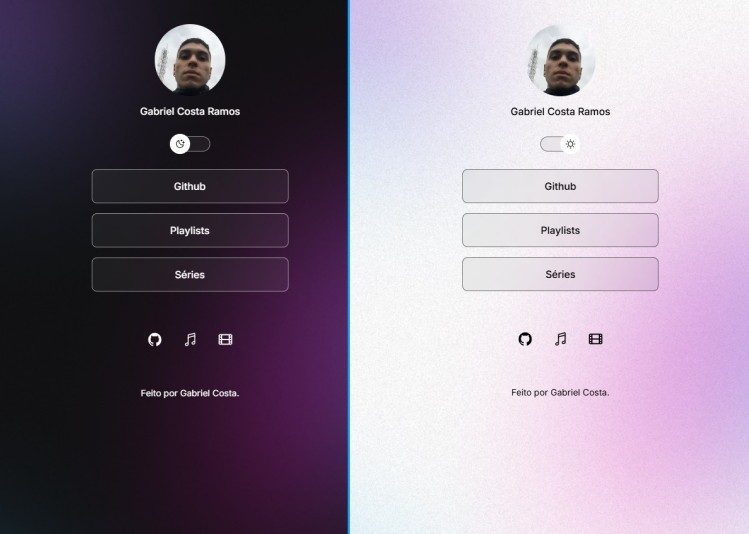

<h1 align="center"> Perfil </h1>

Programa desenvolvido por Gabriel Costa para aprendizagem de tecnologias WEB.  

 

  

## Tecnologias

Esse projeto foi desenvolvido com as seguintes tecnologias:

- HTML e CSS
- JavaScript
- Git e Github
- Figma

## 💻 Projeto

O Perfil é um cartão de visitas online.

- [Acesse o projeto finalizado, online](https://gabrielcostaramos.github.io/perfil/)

## Licença

Esse projeto está sob a licença MIT.

---

Feito por Gabriel Costa
